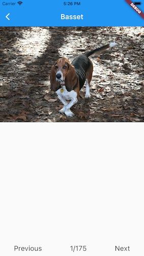

# DogBreeds
___
## Project Description

DogBreeds projects is a Flutter project which creates iOS and Android app.
The main purpose of the app is to explore all Dob Breeds and Dog Sub Breeds.
All data is using from open source dog pictures from www.dog.ceo.

## Scope of this project
This project is build as Demo project during learning of Flutter Technology.
___
## App Screenshots
### iOS

    

### Android

    
